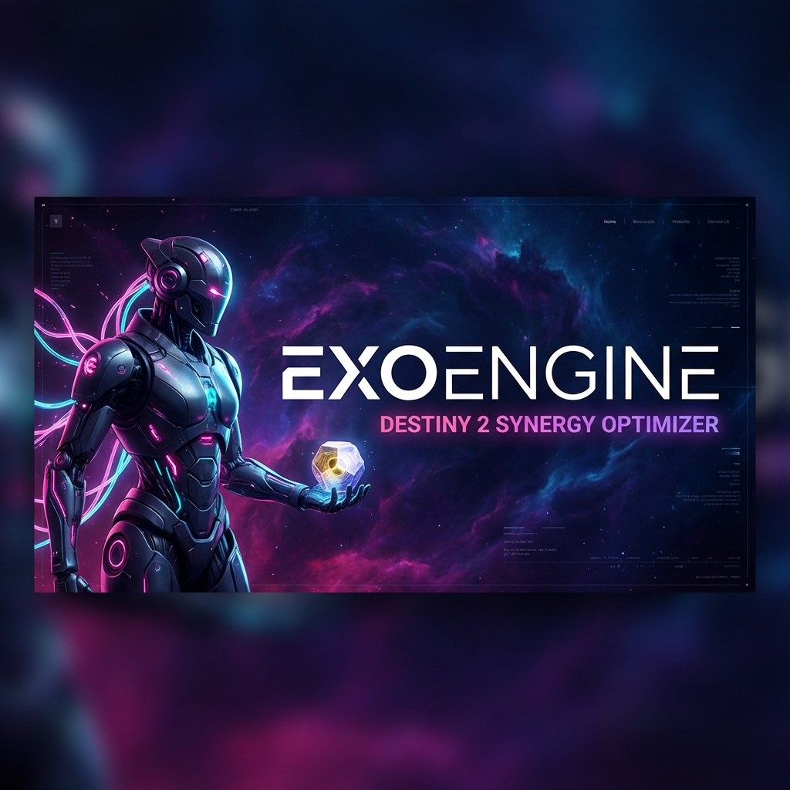

  
  
  # ExoEngine™
  ### The Ultimate Destiny 2 Synergy Optimizer & Loadout Engine
  
  
  
  

---

## 🚀 Overview

**ExoEngine™** is a high-performance web application designed to bridge the gap between casual play and meta-defining optimizations in Destiny 2. It provides a seamless, high-fidelity interface for generating, analyzing, and instantaneously equipping elite combat configurations.

Built with a **Privacy-First** architecture, ExoEngine™ leverages the Bungie API to provide a "Zero-Storage" experience where your data stays on your machine and Bungie's servers.

---

## ✨ Key Features

### � Meta Generator & Chaos Mode
Discover your next favorite build with our algorithmic generation engine.
- **Meta-Sync**: Curated library of hundreds of endgame-ready synergies.
- **Chaos Protocol**: AI-driven randomized permutations for experimental gameplay.
- **Filter Suite**: Sort by Class, Element, or Expansion ownership.

### 🛡️ Vault Guard Analysis
Stop the "is this good?" guesswork. Vault Guard scans your entire account to identify:
- **God-Roll Detection**: Automatically flags 66+ stat rolls and double/triple spikes.
- **Synergy Matching**: Specifically flags armor that enables your currently generated builds.
- **Dismantle Advice**: Intelligent recommendations on what gear to keep or discard.

### ⚡ Instant Deployment
One-click build application that goes deeper than standard loadout managers.
- **Cross-Character Fetching**: Automatically pulls exotics from characters or the vault.
- **Subclass Deep-Plugging**: Sets Super, Abilities, Aspects, and Fragments automatically.
- **In-Game Slot Sync**: Save your configured setup directly to your character's loadout slots.

---

## 🖼️ Interface Preview

  <table width="100%">
    <tr>
      <td width="50%">
        
        
<em>Deep Armor Scoring</em>

      </td>
      <td width="50%">
        
        
<em>Inventory Intelligence</em>

      </td>
    </tr>
  </table>

---

## 🧠 Engineering & Technical Challenges

ExoEngine™ implements several custom solutions to overcome technical hurdles in the Destiny 2 API:

### 1. The Dynamic Fragment Slot Conflict
When applying Aspects, the API doesn't instantly realize new Fragment slots are available. 
- **The Solution**: A multi-threaded pass system. **Pass 1** seats the Aspects; the engine then enters a 1.2s "Wait-state" before **Pass 2** re-verifies the live socket layout and seats Fragments.

### 2. Heuristic Item Resolver
Exotics are frequently reissued with new IDs. 
- **The Solution**: A string-based fuzzy matcher fallback. If an exact hash isn't found, the engine scans your account for any item sharing the same name, ensuring 100% discovery regardless of when you earned the item.

### 3. Community Gold Standard
Inspired by the exceptional standards of **DIM (Destiny Item Manager)**, we've implemented high-reliability write-actions using the `InsertSocketPlugFree` endpoint, ensuring that ExoEngine™ is as robust as the best tools in the ecosystem.

---

## 🛠️ Built With

- **Framework**: React 18 + Vite (for blistering fast HMR)
- **Language**: TypeScript (Type-safe Bungie API interactions)
- **State**: Zustand (Atomic state management)
- **Storage**: IndexedDB (Client-side localized persistence)
- **Logic**: Custom-built Synergy Weights & Inventory Scanning Heuristics

---

## 📖 Getting Started

1. **Connect**: Link your Bungie account via OAuth.
2. **Select**: Choose your Guardian in the header.
3. **Roll**: Use the **Generator** to discover a build.
4. **Deploy**: Hit **Equip** and let the engine handle the transfers and node-plugging.
5. **Save**: Click **Snapshot** to sync to your in-game slots.

---

## 📬 Contact

Developed by **Vj (@Unluckvj)**.

**Made for the Destiny 2 Community.**
