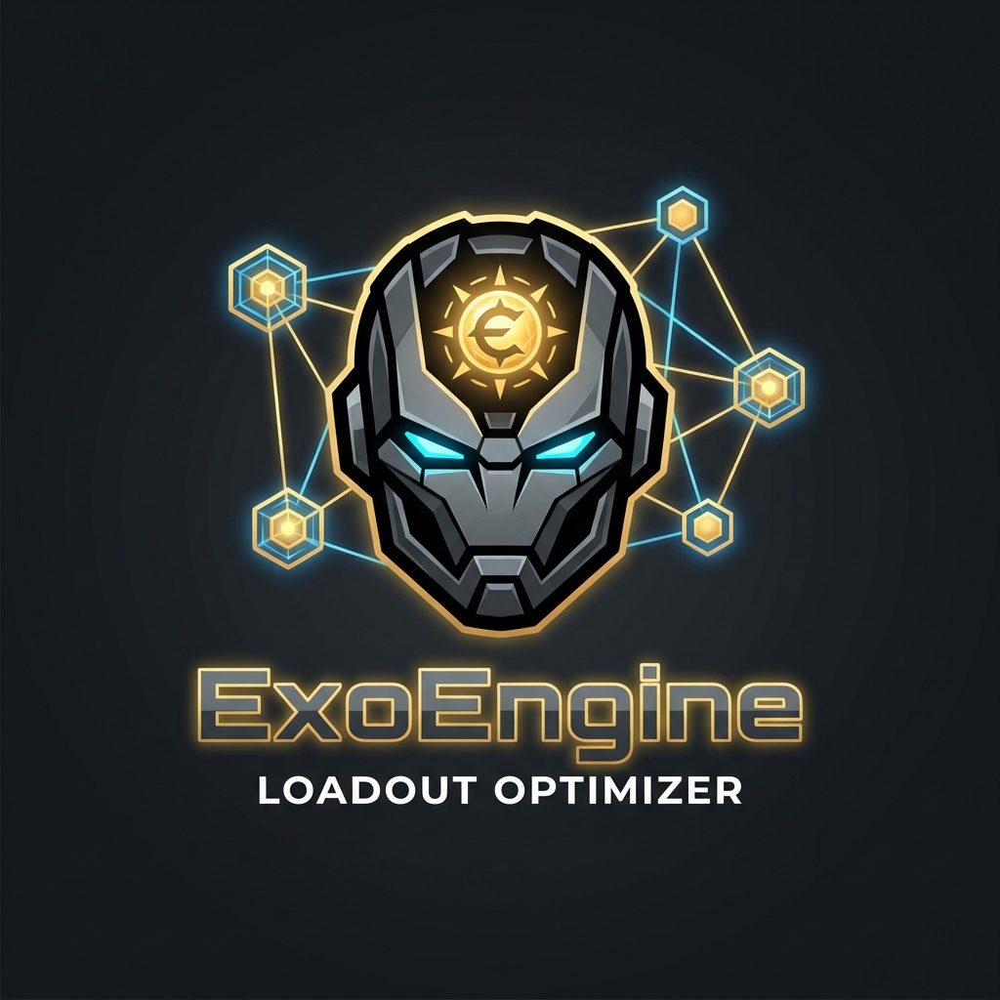
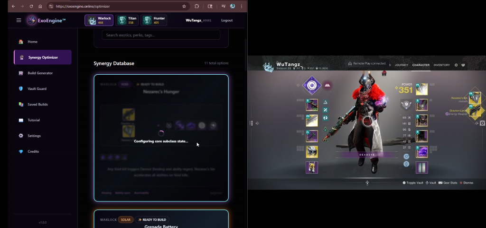

  
  
  # ExoEngine™
  ### Destiny 2 Synergy Optimizer & Random Meta Generator
  
  
  
  

---

## 🚀 Overview

**ExoEngine™** is a specialized tool designed for **New Players** and **Chaos-Lovers**. 

> **Disclaimer:** This is **NOT** a replacement for DIM (Destiny Item Manager). DIM is the gold standard for inventory management, and we love it. 

**ExoEngine exists to fill a specific niche:**
1.  **New Players:** Instantly understand *why* certain exotics and abilities work together through our Synergy Optimizer.
2.  **Veterans:** Break out of the meta. Use our **Random Meta Generator** to force-equip random (but functional) loadouts for a fresh gameplay experience.

---

> [!IMPORTANT]
> **Developer Note:** I am currently developing this project on an aging PC that struggles with modern development workloads. If you enjoy ExoEngine and would like to support full-time development (and help me upgrade to a machine that doesn't crash!), donations are incredibly appreciated. 
> 
> **[Donate via Ko-fi](https://ko-fi.com/unluckvj)**

---

## ✨ Key Features

### 🔮 Synergy Optimizer
For the Guardian who doesn't know what to run.
- **Visual Synergies:** We interpret the game's complex interactions into simple cards.
- **One-Click Equip:** See a build you like? Click "Equip" and we handle the Subclass wiring.

### 🎰 Random Meta Generator
For the Guardian who has everything but is bored of using it.
- **Chaos Mode:** Spin the wheel to get a randomized Loadout (Exotic Armor + Exotic Weapon + Subclass).
- **Smart Filtering:** Filter by Class or Element, but let the engine decide the rest.

### 🛡️ Vault Guard
Stop deleting god-rolls.
- **Armor Analysis:** Scans your vault for high-stat spikes (66+ total) and specific synergy enablers.
- **Keep/Dismantle Advice:** Simple, color-coded recommendations for your gear.

### 📚 Tactical Vault (Saved Builds)
Save your chaos.
- **Snapshot:** Save your generated builds to a local "Tactical Vault".
- **Quick Swap:** Re-equip your favorite random rolls instantly.

---

## 🖼️ Interface Preview

  <table width="100%">
    <tr>
      <td width="50%">
        
        
<em>Synergy Optimizer Cards</em>

      </td>
      <td width="50%">
        
        
<em>Random Meta Generator UI</em>

      </td>
    </tr>
    <tr>
      <td width="50%">
        
        
<em>Vault Guard Analysis</em>

      </td>
      <td width="50%">
        
        
<em>Tactical Vault</em>

      </td>
    </tr>
  </table>
  
  
<em>Seamless Integration with Destiny 2</em>

---

## 🧠 Engineering & Technical Challenges

ExoEngine™ implements unique solutions to solve specific Destiny 2 API hurdles:

### 1. The Dynamic Fragment Slot Conflict
When applying Aspects via the API, the server doesn't instantly "unlock" the corresponding Fragment slots.
- **Solution:** A multi-stage "Heartbeat" system. The engine applies Aspects, waits for a socket-update verification pulse (approx 1.2s), and *then* seats the Fragments in a secondary pass.

### 2. Prismatic Class Handling
Prismatic introduces complex "Any Class" logic for grenades and melees.
- **Solution:** A custom `PrismaticResolver` that maps ability hashes across class boundaries, ensuring that a Warlock's Prismatic grenade is correctly identified even if it originated from a different subclass element.

### 3. Heuristic Item Resolver
Exotics are frequently reissued with new Item Hashes.
- **Solution:** A fuzzy-matching fallback system. If the precise API hash for "Sunbracers" is missing, the engine scans the user's inventory for *any* item matching the name and perk set, ensuring older versions of exotics still work.

---

## 🛠️ Built With

- **Framework:** React 18 + Vite
- **Language:** TypeScript
- **State:** Zustand
- **Storage:** IndexedDB (Local Privacy)
- **Styling:** Custom CSS Variables (Prismatic Theme)

---

## � Known Issues

- **Fragment Plugs:** Occasionally, the API may reject a fragment plug if the socket index shifts during an update. A second "Equip" click usually resolves this.
- **Load Times:** First-time manifest downloads can take a moment depending on Bungie's server load.

---

## 📬 Credits & Contact

**Lead Developer:**
- **Vince (Vj) - [@Unluckvj](https://twitter.com/Unluckvj)**

**Special Thanks:**
- **Bungie API Team:** For providing the incredible platform that makes this possible.
- **Destiny Item Manager (DIM):** For setting the standard and inspiring this project.
- **Destiny 2 Community:** For the endless buildcrafting creativity.

---
**Made with ❤️ for the Guardian Games.**
