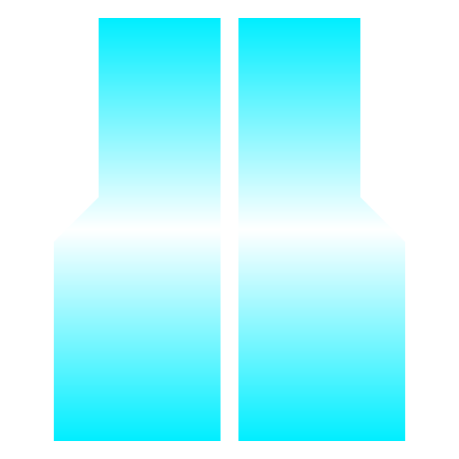

  

# ExoEngine™

## Advanced Build Orchestration and Spatial Visualization for Destiny 2

ExoEngine™ is a high-performance, proprietary platform designed for advanced Destiny 2 loadout management and build orchestration. By leveraging spatial visualization and natural language processing, the platform provides Guardians with an unprecedented interface for inventory management, synergy discovery, and real-time build deployment.

---

## Core Infrastructure

### Agent Wake™: Natural Language Orchestration
Agent Wake™ provides a sophisticated natural language interface for real-time inventory operations. Utilizing advanced text-parsing algorithms, it allows users to execute complex equipment commands through intuitive prose.
- **Dynamic Command Resolution**: Translates natural language into precise API actions for item transfers and equipment.
- **Holistic Build Deployment**: Simultaneously manages weapons, armor, subclasses, and all associated modification sockets.
- **Cross-Character Coordination**: Orchestrates multi-stage transfers involving the vault and character inventories to ensure seamless build transitions.

### Synergy Galaxy™: Spatial Visualization Engine
The Synergy Galaxy™ represents a paradigm shift in inventory visualization. It projects a player's entire arsenal into a 3D spatial map, allowing for intuitive navigation of vast equipment sets.
- **Spatial Node Architecture**: Visualizes every item as a discrete node within a high-performance canvas renderer.
- **Interactive Synergy Mapping**: Displays real-time visual connections between equipment pieces, highlighting elemental and exotic interactions.
- **Advanced Projection Technology**: Features a custom projection system with immersive drift and parallax effects to enhance spatial awareness.
- **Bi-Directional Synchronization**: Maintains a constant state of alignment with the Bungie.net API for real-time inventory accuracy.

### Build Architect and Collection Management
ExoEngine™ empowers users to catalog and deploy sophisticated loadouts with precision.
- **Local-First Data Persistence**: Utilizes IndexedDB for secure, localized storage of build templates without external server dependencies.
- **Snapshot Capture**: Enables the immediate preservation of currently equipped configurations, including all intricate mod and subclass settings.
- **Intelligence-Driven Generation**: Features a randomized build architect that respects expansion ownership and damage-type filters to suggest functional equipment combinations.

---

## Technical Specifications

ExoEngine™ is engineered for high-fidelity performance and data integrity.

### Performance Engineering
- **Optimized Manifest Pipeline**: Implements a sophisticated manifest trimming system, reducing the localized cache footprint by over 90% compared to standard implementations.
- **Asynchronous Modular Architecture**: Utilizes advanced code splitting into dozens of optimized chunks to ensure minimal initial load latency.
- **Response Validation**: Employs timestamp protection and stale-data rejection to maintain synchronization integrity during high-latency API states.

### Privacy and Security
- **Localized Execution**: All inventory analysis and build management occurs client-side, ensuring data sovereignty.
- **Encrypted Authentication**: OAuth tokens are managed with industry-standard encryption protocols.
- **Telemetry Minimalization**: The platform is designed to operate without intrusive analytics or tracking.

---

## Technical Stack
- **Framework**: React 19 with TypeScript 5
- **Build Infrastructure**: Vite 7
- **State Orchestration**: Zustand
- **Graphics Pipeline**: Custom Spatial Canvas Renderer
- **Data Layer**: Proprietary Bungie.net API Integration and IndexedDB

---

## Usage Requirements

### Initialization
1. Authenticate via the secure Bungie.net OAuth portal.
2. Allow the initial manifest synchronization to proceed (time varies based on network conditions).
3. Access the core modules—Agent Wake™, Synergy Galaxy™, and the Build Architect—via the primary navigation interface.

### Deployment Guidelines
- **Activity Restrictions**: Certain equipment operations (such as subclass modification) are restricted by the Bungie API to non-combat zones such as Orbit or Social Spaces.
- **Socket Limitations**: Equipment mod changes are subject to the standard energy and slot limitations imposed by the Destiny 2 sandbox.

---

## Legal and Trademark Information

**ExoEngine™ is a proprietary trademark. All rights reserved.**

### Intellectual Property Statement
ExoEngine™ and all associated module names (Agent Wake™, Synergy Galaxy™) are trademarks of their respective owner. Unauthorized reproduction, distribution, or decompilation of this platform's assets or code is strictly prohibited.

### Disclaimer
ExoEngine™ is a third-party utility. It is not affiliated with, endorsed by, or associated with Bungie, Inc. Destiny 2 assets and terminology are the intellectual property of Bungie, Inc.
