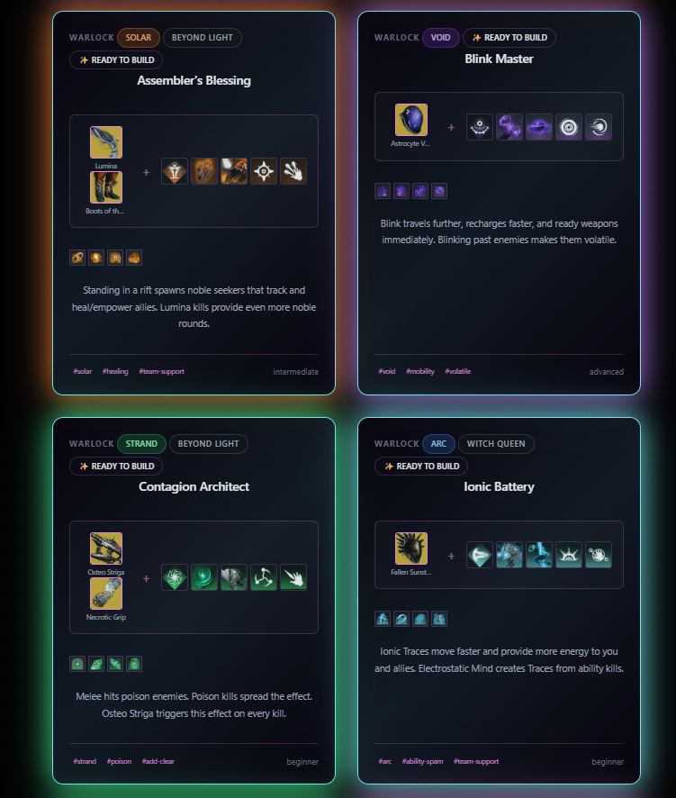
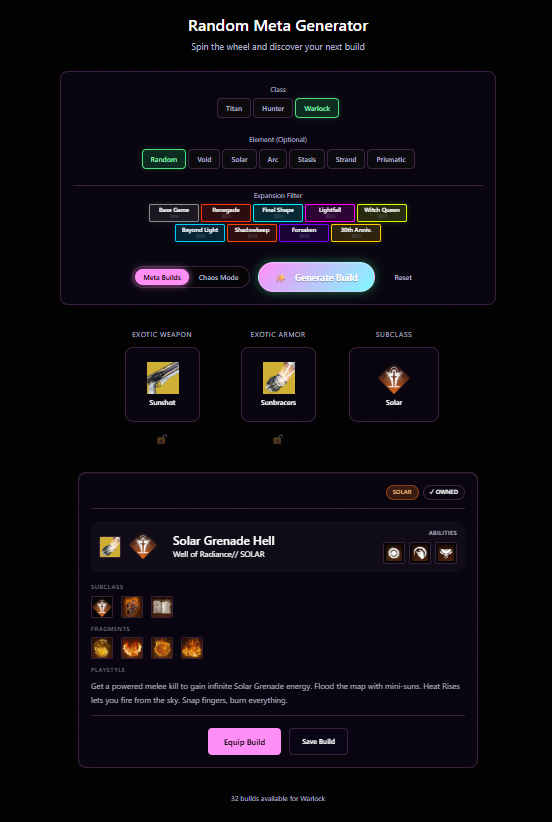
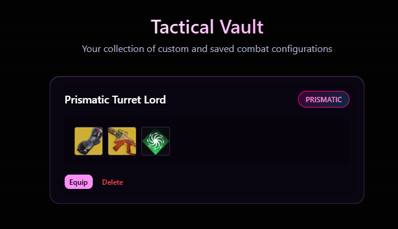

<div align="center">
  
  
  # ExoEngine™
  ### The Universe of Build Synergies - Visualized
  
  **Destiny 2's First Interactive 3D Synergy Explorer**
  
  [](https://exoengine.online)
  [](https://exoengine.online)
  [](https://twitter.com/Unluckvj)
  
  ---
  
  
</div>

<br/>

## 🌌 What is ExoEngine?

**ExoEngine** is a next-generation Destiny 2 build discovery tool that transforms the overwhelming question *"What should I run?"* into an immersive visual experience. Instead of spreadsheets and lists, you explore a **3D galaxy of synergies** where every exotic, subclass, and mod is interconnected.

### 🎯 Built For:
- 🆕 **New Players** - Visual learning without the wiki rabbit hole
- 🎲 **Chaos Lovers** - Randomized meta builds for experienced Guardians
- 🔬 **Theorycrafters** - Deep synergy analysis with one-click equipping
- 🎨 **Build Collectors** - Save and share your discoveries

> **Note:** ExoEngine is a **companion tool** to DIM (Destiny Item Manager), not a replacement. DIM remains the gold standard for inventory management. We focus on **build discovery and visual storytelling**.

---

## ✨ Core Features

### 🌌 **Synergy Galaxy** - The Heart of ExoEngine

The **Synergy Galaxy** is a fully interactive 3D visualization where every piece of gear in your vault becomes a node in space. Connections represent synergies, and you can:

- 🔍 **Zoom & Navigate** - Fly through your entire arsenal in real-time
- 🎯 **Click to Equip** - One click transfers and equips items across characters
- 🕸️ **See Relationships** - Visual wires connect synergistic exotics, aspects, and fragments
- 🎨 **Color-Coded Elements** - Solar, Void, Arc, Stasis, Strand at a glance
- 🔄 **Live Inventory** - Real-time sync with Bungie's API
- 📱 **Mobile Optimized** - Touch controls for tablet gameplay

**How it works:**
1. Your entire vault loads as a 3D constellation
2. Equipped items are highlighted with glowing rings
3. Click any exotic to see its synergies light up
4. Click a synergy to auto-equip the full build
5. Drag to rotate, scroll to zoom, double-tap to focus

<div align="center">
  
  <p><em>Your vault, visualized as an explorable universe</em></p>
</div>

---

### 🎰 **Chaos Generator** - Random Meta Builds

Tired of running the same loadout? Spin the wheel and get a **fully functional random build** complete with:

- ✅ Exotic Armor + Exotic Weapon matched to your subclass
- ✅ Auto-configured Aspects & Fragments
- ✅ Recommended Armor Mods (Siphons, Surges, Reloaders)
- ✅ Smart filtering by Class and Element
- ✅ One-click equip from the Generator

Perfect for:
- Breaking out of meta comfort zones
- Discovering forgotten exotics in your vault
- Content creator challenges
- Late-night Guardian shenanigans

<div align="center">
  
</div>

---

### 🛡️ **Tactical Vault** - Build Management

Save your favorite discoveries to your **private local vault**:

- 💾 **Local-First Storage** - No servers, your builds stay on your device
- 📸 **One-Click Capture** - Snapshot your *entire* loadout (15+ mods included)
- 🏷️ **Smart Tagging** - Auto-categorized by class, element, and exotic
- 🔗 **Universal Sharing** - Generate links that work in ExoEngine AND DIM
- 📊 **Build Analytics** - See your most-used exotics and playstyles

<div align="center">
  
</div>

---

### 🔗 **DIM Integration** - Universal Compatibility

ExoEngine plays nice with the Destiny ecosystem:

- 🔄 **Import DIM Links** - Paste any `dim.gg` share link to visualize it in 3D
- 📤 **Export to DIM** - Generate DIM-compatible links from your builds
- 🌐 **Universal Sharing** - Share links that work in both ExoEngine and DIM
- 📋 **Deep Loadout Support** - Full mod, aspect, and fragment preservation

---

## 🧠 Under the Hood

ExoEngine is built with DIM-grade engineering for Destiny 2 API challenges:

### 🎯 **Smart Inventory Management**
- **Multi-Character Transfers** - Automatically routes items through vault when needed
- **Proactive Space Checks** - Prevents transfer failures before they happen
- **Exotic Conflict Resolution** - Intelligently swaps exotics without breaking your loadout
- **Optimistic UI Updates** - Instant feedback with API validation

### 🔐 **Security & Privacy**
- **Local-First Architecture** - Your vault data stays on your device
- **Encrypted Token Storage** - AES-GCM encryption for OAuth tokens
- **No Analytics Tracking** - Your builds are yours alone
- **Open Source** - Audit the code yourself

### ⚡ **Performance Optimizations**
- **Manifest Trimming** - 90% smaller manifest cache (<10MB vs 100MB+)
- **Code Splitting** - 23 optimized chunks for fast initial load
- **Timestamp Protection** - Rejects stale API responses automatically
- **Dynamic Fragment Slots** - Handles Aspect→Fragment dependencies gracefully

### 🔧 **Tech Stack**
```
Frontend:     React 19 + TypeScript
Build Tool:   Vite 7
State:        Zustand (5KB)
Storage:      IndexedDB + Encryption
Styling:      Custom CSS (Glassmorphism + Prismatic)
3D Engine:    Custom Canvas Renderer
API:          Bungie.net + DIM Mappings
```

---

## 🚀 Quick Start

### Prerequisites
- Node.js 18+ 
- Bungie.net Developer Application ([Create one here](https://www.bungie.net/en/Application))
- Your app must be **Confidential OAuth** (not Public) for refresh tokens

### Installation

1. **Clone the repository**
```bash
git clone https://github.com/luckvj/ExoEngine.git
cd ExoEngine
```

2. **Install dependencies**
```bash
npm install
```

3. **Configure environment**
Create a `.env` file:
```env
VITE_BUNGIE_API_KEY=your_api_key
VITE_BUNGIE_CLIENT_ID=your_client_id
VITE_BUNGIE_CLIENT_SECRET=your_client_secret
```

4. **Start development server**
```bash
npm run dev
```

5. **Build for production**
```bash
npm run build
# Output → /web folder (ready to deploy)
```

---

## 📖 Usage Guide

### First Time Setup
1. Visit https://exoengine.online (or your deployed instance)
2. Click "Connect to Bungie.net" and authorize
3. Wait for your vault to sync (~5-10 seconds)
4. You're in! Your entire arsenal is now a 3D galaxy

### Navigating the Galaxy
- **Mouse:** Drag to rotate, scroll to zoom
- **Touch:** Swipe to rotate, pinch to zoom
- **Click Node:** See item details and synergies
- **Double-Click:** Auto-equip the item
- **ESC:** Reset camera view

### Equipping a Synergy Build
1. Click any exotic armor in the galaxy
2. View the synergy sidebar on the right
3. Click a synergy card
4. ExoEngine auto-equips: Exotic + Subclass + Aspects + Fragments + Mods

### Saving a Build
1. Equip your desired loadout
2. Go to "Tactical Vault" tab
3. Click "Capture Current Loadout"
4. Name it and save!

---

## 🐛 Known Limitations

- **Error 1663:** Subclass changes only work in Orbit/Social spaces (Bungie API restriction)
- **Error 1676:** Some mod combinations fail due to energy cost limits
- **Mobile Performance:** Galaxy may lag on older mobile devices (optimization ongoing)

---

## 🤝 Contributing

ExoEngine is open source! Contributions are welcome:

- 🐛 **Bug Reports:** [Open an issue](https://github.com/luckvj/ExoEngine/issues)
- ✨ **Feature Requests:** [Start a discussion](https://github.com/luckvj/ExoEngine/discussions)
- 🔧 **Pull Requests:** Fork, branch, and submit!

### Development Priorities
- [ ] Mobile performance optimization
- [ ] Weapon synergy mapping
- [ ] Seasonal artifact integration
- [ ] Community build sharing hub

---

## 💖 Support Development

> [!IMPORTANT]
> ExoEngine is developed solo on an aging PC. If this tool enhances your Guardian experience, consider supporting continued development!

**Ways to Support:**
- ☕ **[Buy me a Ko-fi](https://ko-fi.com/unluckvj)**
- ⭐ **Star this repo** on GitHub
- 🐦 **Share** on Twitter with #ExoEngine
- 🎮 **Use it** and provide feedback!

Every contribution helps maintain servers and fund new features.

---

## 📬 Credits & Contact

**Created by:** Vince (Vj)  
**Twitter:** [@Unluckvj](https://twitter.com/Unluckvj)  
**Website:** [exoengine.online](https://exoengine.online)  
**GitHub:** [luckvj/ExoEngine](https://github.com/luckvj/ExoEngine)

### Special Thanks
- **Bungie** - For the incredible API and 10 years of Destiny
- **DIM Team** - For setting the standard and open-source inspiration
- **Destiny Community** - For endless buildcrafting creativity
- **Early Testers** - You know who you are 💙

---

## 📄 License

This project is licensed under the **MIT License** - see the [LICENSE](LICENSE) file for details.

### Legal Disclaimer
ExoEngine is a fan-made tool and is not affiliated with, endorsed by, or associated with Bungie, Inc. or Destiny 2. All Destiny 2 assets, names, and trademarks are property of Bungie, Inc.

---

<div align="center">
  
### 🌌 Explore. Discover. Dominate.

**Made with ❤️ for Guardians, by Guardians**

[🚀 Launch ExoEngine](https://exoengine.online) | [📖 Documentation](https://github.com/luckvj/ExoEngine/wiki) | [💬 Discord](#)

---

*"Eyes up, Guardian. Your next build awaits in the stars."*

</div>
